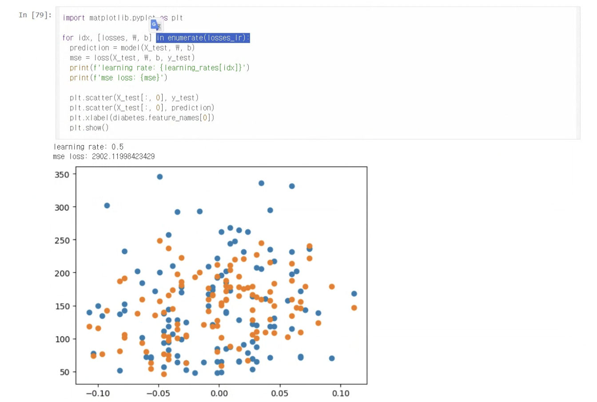
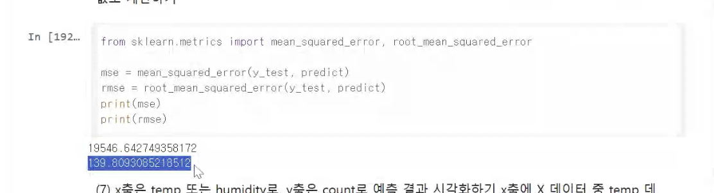
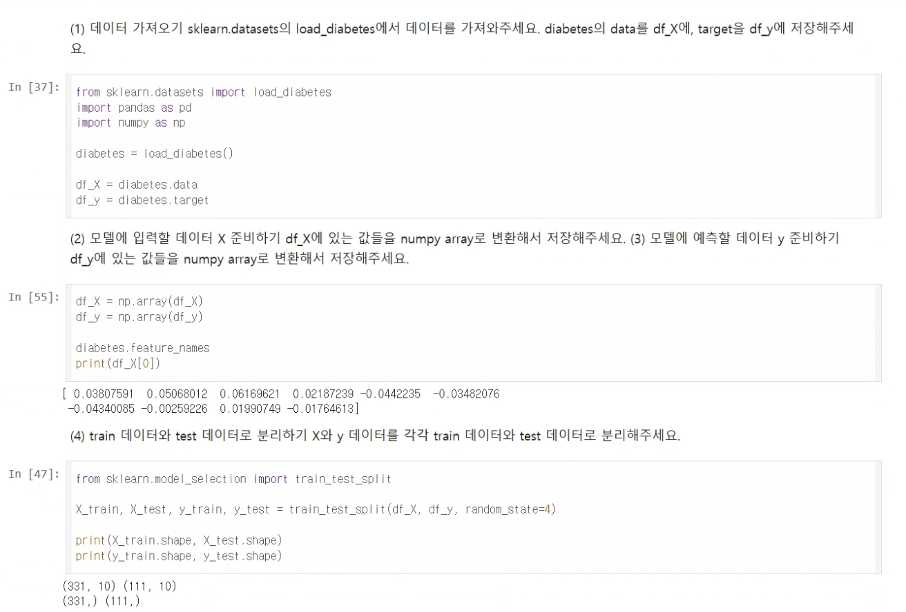
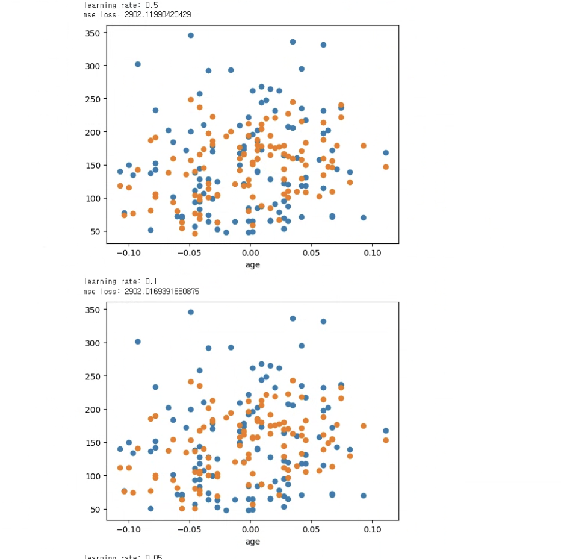
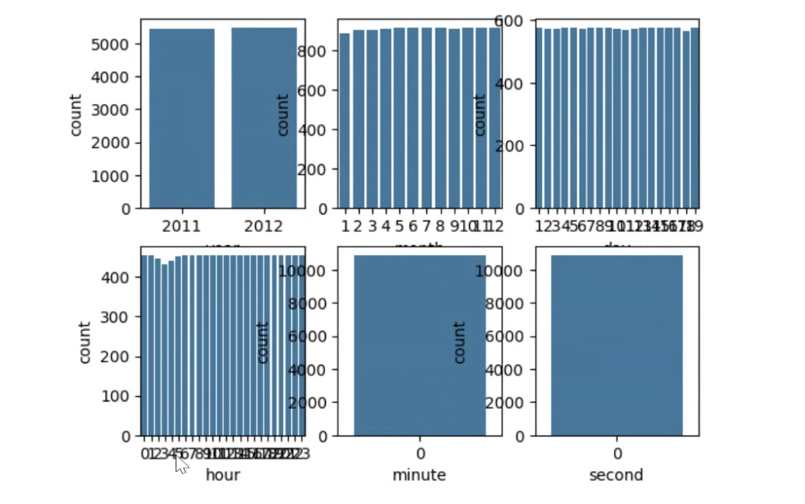
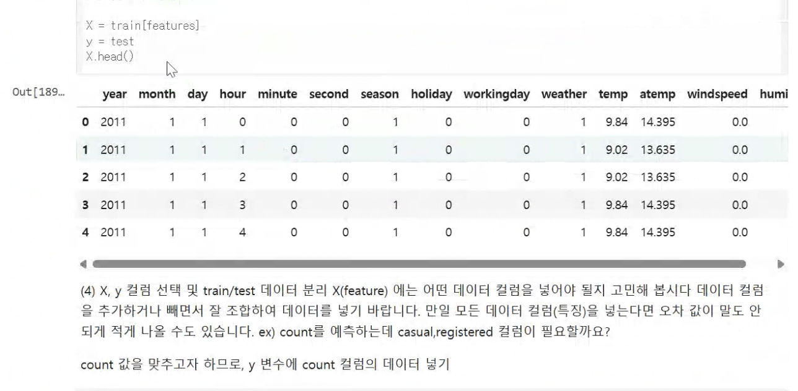

# AIFFEL Campus Online Code Peer Review Templete
- 코더 : 임한결.
- 리뷰어: 신기성.


# PRT(Peer Review Template)
- [o]  **1. 주어진 문제를 해결하는 완성된 코드가 제출되었나요?**
    - 문제에서 요구하는 최종 결과물이 첨부되었는지 확인
        **네 문제에서 요구하는 최종 결과물이 첨부 되었습니다.**
        - 중요! 해당 조건을 만족하는 부분을 캡쳐해 근거로 첨부

        ### 이미지 파일 올리는 형식
    
    
    
- [o]  **2. 전체 코드에서 가장 핵심적이거나 가장 복잡하고 이해하기 어려운 부분에 작성된 
주석 또는 doc string을 보고 해당 코드가 잘 이해되었나요?**
    - 해당 코드 블럭을 왜 핵심적이라고 생각하는지 확인
    **핵심 코드 블럭은 데이터를 가져오는데 중요 하고 핵심적이라고 생각합니다.**
    - 해당 코드 블럭에 doc string/annotation이 달려 있는지 확인
    **네 잘 밑에 잘 설명 되어있습니다**
    - 해당 코드의 기능, 존재 이유, 작동 원리 등을 기술했는지 확인
    **해당 코드의 기능,존재 이유,작동원리도 어느정도 잘 설명 되어있습니다** 
    - 주석을 보고 코드 이해가 잘 되었는지 확인
    **네 코드가 이해가 어느정도 이해가 됩니다**
        - 중요! 잘 작성되었다고 생각되는 부분을 캡쳐해 근거로 첨부

         
        
- [o]  **3. 에러가 난 부분을 디버깅하여 문제를 해결한 기록을 남겼거나
새로운 시도 또는 추가 실험을 수행해봤나요?**
    - 문제 원인 및 해결 과정을 잘 기록하였는지 확인
    **네 각각의 learning rate을 진행해서 보여줬습니다**
    - 프로젝트 평가 기준에 더해 추가적으로 수행한 나만의 시도, 
    실험이 기록되어 있는지 확인
    **네 프로젝트 평가 기준에 더해 추가적으로 수행된 부분또한 잘 서술해서 보여주셨습니다**
        - 중요! 잘 작성되었다고 생각되는 부분을 캡쳐해 근거로 첨부
        
   
     
        
- [o]  **4. 회고를 잘 작성했나요?**
    - 주어진 문제를 해결하는 완성된 코드 내지 프로젝트 결과물에 대해
    배운점과 아쉬운점, 느낀점 등이 기록되어 있는지 확인
    **문제를 해결하는 완성된 코드 내지 프로젝트 결과물에 대해 각 코드 마다 설명이 되어있었습니다**
    - 전체 코드 실행 플로우를 그래프로 그려서 이해를 돕고 있는지 확인
    **네 전체적인 코드 실행 플로우 와 그래프가 서로 이해를 돕는데 도움이 됩니다.**
    
     - 중요! 잘 작성되었다고 생각되는 부분을 캡쳐해 근거로 첨부
     
   
        
- [o]  **5. 코드가 간결하고 효율적인가요?**
    - 파이썬 스타일 가이드 (PEP8) 를 준수하였는지 확인
    **동작에 아무이상 없이 진행 된것으로 보아 PEP8을 가이드라인을 준수 하였습니다**
    - 코드 중복을 최소화하고 범용적으로 사용할 수 있도록 함수화/모듈화했는지 확인
    **코드 중복이 거의 없고 범용적으로 필요한 코드들만 잘 함수화 하고 모듈화 해서 사용하였습니다**
    
     - 중요! 잘 작성되었다고 생각되는 부분을 캡쳐해 근거로 첨부
     
        

    
# 회고(참고 링크 및 코드 개선)


```
# 리뷰어의 회고를 작성합니다.

임한결님께서 작성한 코드가 정말 정밀하고 잘 짜여지고 확실히 학습에 관련된 부분에 대해서는 할 말이 없다 생각 됩니다.
정말 우리가 수업중에 배운 내용을 심도있게 표현을 잘하고 적재적소에 맞게 사용한것 같습니다. 
또한 리뷰어가 봤을때 이해하기 쉽고 정리가 깔끔하게 되어있어, 한눈에 알아 볼 수 있었던 것 같습니다.

# 코드 리뷰 시 참고한 링크가 있다면 링크와 간략한 설명을 첨부합니다.
전 리뷰를 하면서 다시 한 번 우리가 배운 내용을 복습 할 수 있는 계기가 되었고, 여기서 MAE는 안 다뤘지만, 
Mean Squared Error 나 Root Mean Squard Error 혹은 R-squared의 의미를 실전을 통해서 조금 더 내용에 대해서 
이해 할 수 있었던 것 같고 저번에 배웠었던 내용중 다음 과 같은 내용의 링크를 참조 하였습니다. 
[Regression Model Accuracy (MAE, MSE, RMSE, R-squared) Check in R](https://www.datatechnotes.com/2019/02/regression-model-accuracy-mae-mse-rmse.html)

# 코드 리뷰를 통해 개선한 코드가 있다면 코드와 간략한 설명을 첨부합니다.
솔직히 임한결님 코드를 보면서 개선 할 수 있는 코드는 딱히 제 눈으로 바라본 시각에서는 없어 보였습니다.
구지 있다 그런다면, 부가적으로 조금 더 시각적인 부분을 설명 해줄 수 있는 코드를 첨가 해주면 좋을것 같다는 생각이 들었습니다.
예를 들면, 회귀 분석에서 linear 하게 regression을 그려서 predicted value 가 예측 한 그림 과 분포도가 어떻게 다른지 보여줄 수 있는 부분을 첨가해주면 좋겠다
라는 생각을 했습니다.
```
