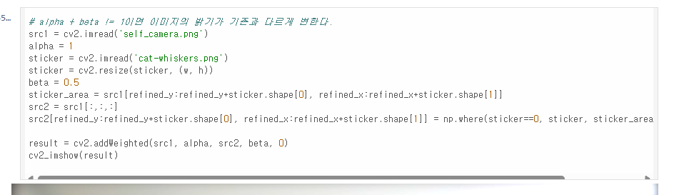
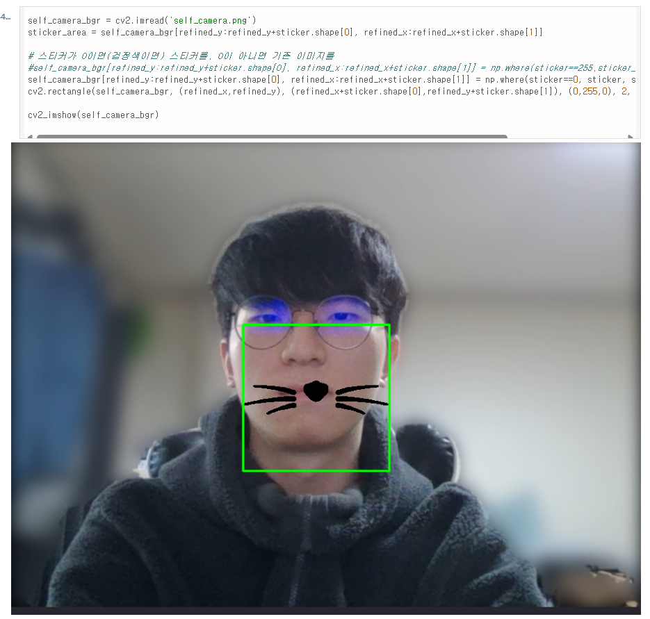
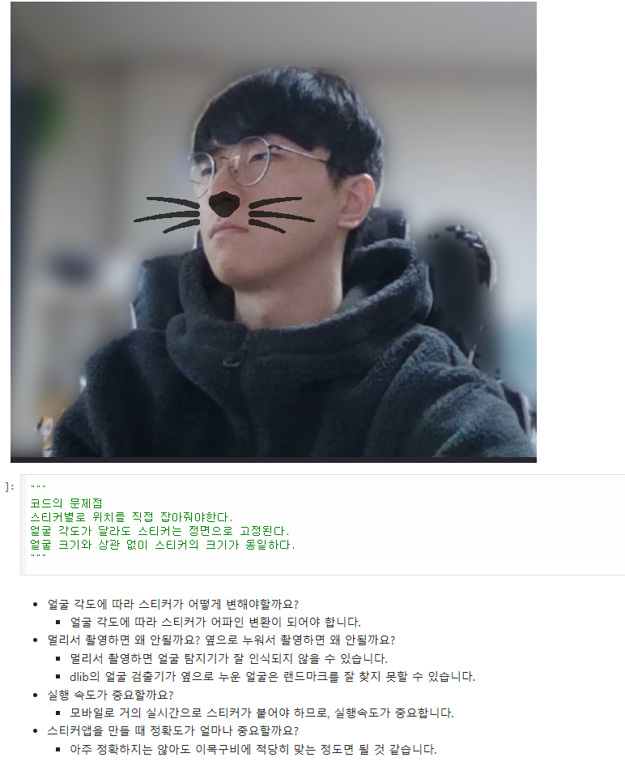

# AIFFEL Campus Online Code Peer Review Templete
- 코더 : 임한결
- 리뷰어 : 박수연


# PRT(Peer Review Template)
- [X]  **1. 주어진 문제를 해결하는 완성된 코드가 제출되었나요?**
    - 문제에서 요구하는 최종 결과물이 첨부되었는지 확인
        - 중요! 해당 조건을 만족하는 부분을 캡쳐해 근거로 첨부

        - 프로젝트 결과물을 완성했습니다.
        

- [X]  **2. 전체 코드에서 가장 핵심적이거나 가장 복잡하고 이해하기 어려운 부분에 작성된 
주석 또는 doc string을 보고 해당 코드가 잘 이해되었나요?**
    - 해당 코드 블럭을 왜 핵심적이라고 생각하는지 확인
    - 해당 코드 블럭에 doc string/annotation이 달려 있는지 확인
    - 해당 코드의 기능, 존재 이유, 작동 원리 등을 기술했는지 확인
    - 주석을 보고 코드 이해가 잘 되었는지 확인
        - 중요! 잘 작성되었다고 생각되는 부분을 캡쳐해 근거로 첨부

        - 전체 흐름을 이해하기 쉽게 코드가 작성되어 있어 좋았습니다.
        - 각 주석을 통해 이해하기 쉬웠습니다. 
        - 
        - 블렌딩 처리 코드가 명확하고 좋아서 인상깊었습니다.
        - 
        
- [X]  **3. 에러가 난 부분을 디버깅하여 문제를 해결한 기록을 남겼거나
새로운 시도 또는 추가 실험을 수행해봤나요?**
    - 문제 원인 및 해결 과정을 잘 기록하였는지 확인
    - 프로젝트 평가 기준에 더해 추가적으로 수행한 나만의 시도, 
    실험이 기록되어 있는지 확인
        - 중요! 잘 작성되었다고 생각되는 부분을 캡쳐해 근거로 첨부

        - 최적의 위치를 찾기위해 여러 실험을 진행한 부분이 인상깊었습니다.
        - 
        
- [X]  **4. 회고를 잘 작성했나요?**
    - 주어진 문제를 해결하는 완성된 코드 내지 프로젝트 결과물에 대해
    배운점과 아쉬운점, 느낀점 등이 기록되어 있는지 확인
    - 전체 코드 실행 플로우를 그래프로 그려서 이해를 돕고 있는지 확인
        - 중요! 잘 작성되었다고 생각되는 부분을 캡쳐해 근거로 첨부

        - 여러 각도 사진을 통해 회고를 진행한 부분이 좋았습니다.
        - 
        
- [X]  **5. 코드가 간결하고 효율적인가요?**
    - 파이썬 스타일 가이드 (PEP8) 를 준수하였는지 확인
    - 코드 중복을 최소화하고 범용적으로 사용할 수 있도록 함수화/모듈화했는지 확인
        - 중요! 잘 작성되었다고 생각되는 부분을 캡쳐해 근거로 첨부
  
        - 전체 코드를 함수화해서 작성해서 매우 좋았습니다.
        - 


# 회고(참고 링크 및 코드 개선)
```
최적의 스티커 위치를 찾기 위해 여러 실험을 진행한 부분이 매우 좋고, 많이 배웠습니다.
스티커와 원본 이미지를 블렌딩 처리 기법을 간결하고 명확한 코드로 정리한 부분이 매우 좋고 배우고 싶습니다.
시각화로 디버깅을 진행부분이 너무 좋고 저도 이런부붙을 배우고 싶다고 생각합니다.
```
