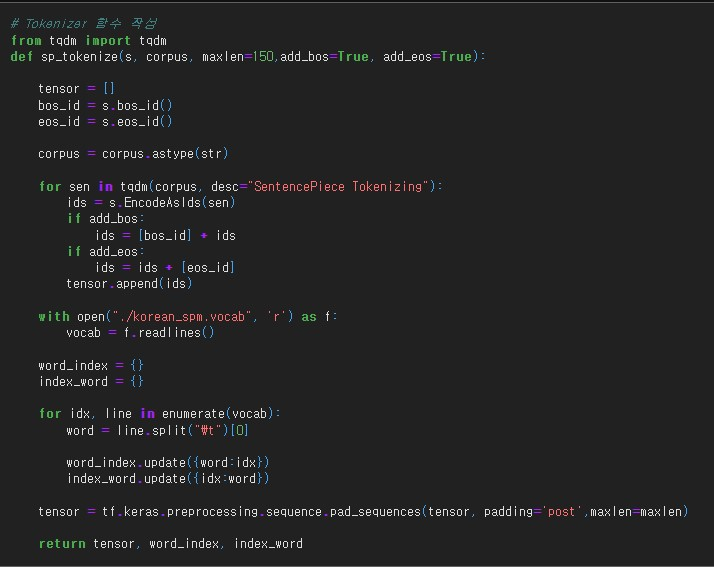
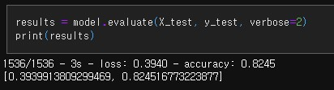
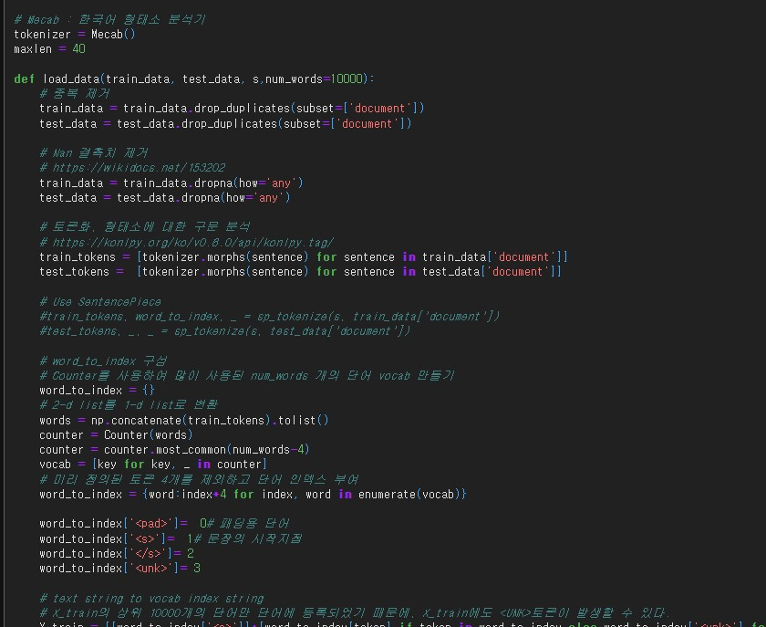
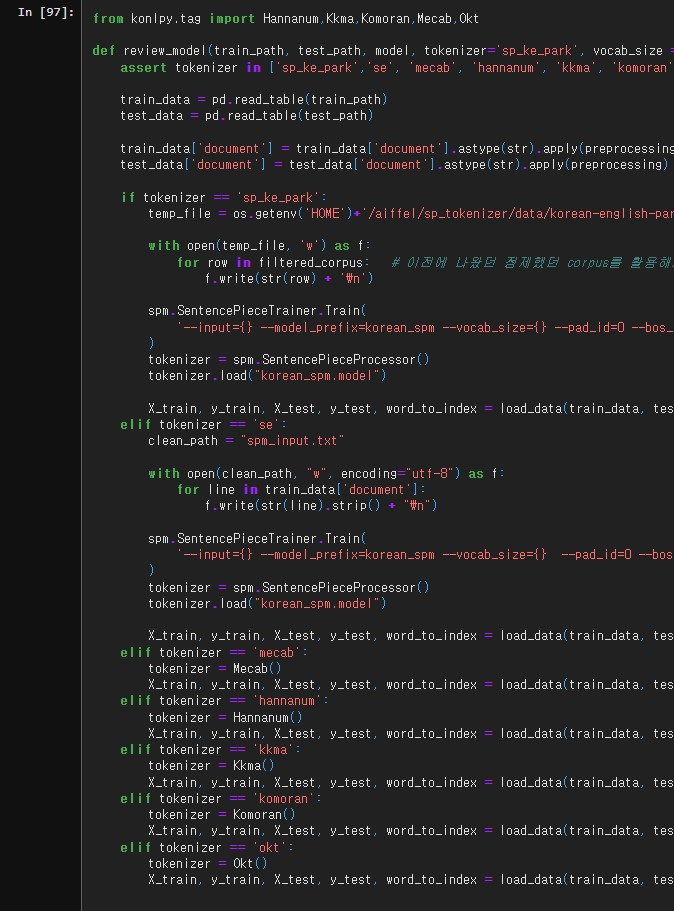

# AIFFEL Campus Online Code Peer Review Templete
- 코더 : 임한결
- 리뷰어 : 김범모

# PRT(Peer Review Template)
- [ O ]  **1. 주어진 문제를 해결하는 완성된 코드가 제출되었나요?**
   - sentence piece 토크나이저 함수를 작성 하였습니다.
     
   - test 데이터 정확도 82% 달성하였습니다.
     
    
- [ O ]  **2. 전체 코드에서 가장 핵심적이거나 가장 복잡하고 이해하기 어려운 부분에 작성된 
주석 또는 doc string을 보고 해당 코드가 잘 이해되었나요?**
    - 주석이 달려있어서 이해하기 쉬웠습니다.
    
    
        
- [ O ]  **3. 에러가 난 부분을 디버깅하여 문제를 해결한 기록을 남겼거나
새로운 시도 또는 추가 실험을 수행해봤나요?**
    - 여러 토크나이저를 사용하여 실험을 진행 하였습니다.
    

- [ O ]  **4. 회고를 잘 작성했나요?**
    - 중간중간 모델 실험 설명과 회고가 작성되어있었습니다.
    
        
- [ O ]  **5. 코드가 간결하고 효율적인가요?**
    - 기능별로 함수화 하였고 코드가 간결하였습니다.

# 회고(참고 링크 및 코드 개선)
여러 토크나이저로 실험해보시고 프로젝트 평가 항목도 다 만족하셔서 배울점이 많았습니다!
